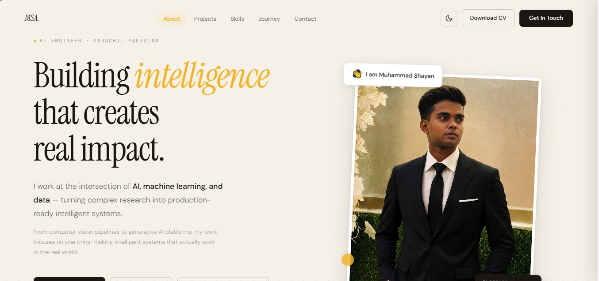

# Muhammad Shayan Ahmed — Developer Portfolio

<div align="center">

[](https://shayan-portfolio-eight.vercel.app/)
[](https://react.dev/)
[](https://vitejs.dev/)
[](LICENSE)

### Modern Developer Portfolio built with React & Vite

A modern, responsive portfolio showcasing my projects, technical skills, experience, and journey in **Artificial Intelligence, Machine Learning, Backend Development, and Data Analytics**.

🌐 **Live Portfolio:** **https://shayan-portfolio-eight.vercel.app/**

</div>

---

## 📸 Preview

<div align="center">



</div>

---

# ✨ Features

- 🎨 Modern and minimal user interface
- 📱 Fully responsive across all devices
- ⚡ Built with React 19 and Vite
- 🎭 Smooth scroll reveal animations
- 🖱️ Custom animated cursor
- 📊 Scroll progress indicator
- 💼 Interactive project showcase
- 🖼️ Project image hover effects
- 🧩 Skills & technology section
- 📈 Experience timeline
- 📬 Functional contact form using FormSubmit
- 🚀 Optimized for performance

---

# 🛠️ Tech Stack

### Frontend

- React 19
- Vite
- JavaScript (ES6+)
- HTML5
- CSS3

### Tools & Deployment

- Git
- GitHub
- VS Code
- Vercel
- FormSubmit

---

# 📂 Project Structure

```text
.
├── public/
├── src/
│   ├── assets/
│   ├── components/
│   ├── data/
│   ├── hooks/
│   ├── App.jsx
│   ├── main.jsx
│   └── index.css
├── index.html
├── package.json
├── vite.config.js
├── vercel.json
└── README.md
```

---

# 🚀 Getting Started

### Clone the repository

```bash
git clone https://github.com/MuhammadShayan8401/shayan-portfolio.git
```

### Navigate into the project

```bash
cd shayan-portfolio
```

### Install dependencies

```bash
npm install
```

### Start the development server

```bash
npm run dev
```

Open your browser and visit:

```
http://localhost:5173
```

---

# 📦 Build for Production

```bash
npm run build
```

Preview the production build locally:

```bash
npm run preview
```

---

# 🌍 Live Demo

🔗 **Portfolio Website**

**https://shayan-portfolio-eight.vercel.app/**

---

# 🚀 Deployment

This portfolio is deployed using **Vercel**.

To deploy your own version:

```bash
npm install -g vercel
vercel
```

Or simply import the GitHub repository into Vercel for automatic deployment.

---

# 📁 Managing Projects

All project information is stored inside:

```text
src/data/projects.js
```

Each project includes:

- Project Title
- Description
- Technologies
- Live Demo
- GitHub Repository
- Project Screenshot
- Key Features

Simply edit the data file to update your portfolio.

---

# 📬 Contact Form

The contact form is powered by **FormSubmit**, allowing visitors to send messages without requiring a backend server.

To change the destination email, update the FormSubmit endpoint inside:

```text
src/components/Contact.jsx
```

---

# 👨‍💻 About Me

I'm **Muhammad Shayan Ahmed**, a Software Engineering student at **Sir Syed University of Engineering & Technology (SSUET)**.

I'm passionate about building intelligent software and modern web applications using technologies such as:

- 🤖 Artificial Intelligence
- 🧠 Machine Learning
- ⚙️ FastAPI
- 🌐 React
- 🐍 Python
- 🗄️ SQL
- 📊 Data Analytics

I enjoy solving real-world problems through software engineering while continuously learning new technologies and frameworks.

---

# 🤝 Connect With Me

🌐 **Portfolio**  
https://shayan-portfolio-eight.vercel.app/

💼 **LinkedIn**  
https://www.linkedin.com/in/muhammad-shayan-ahmed/

💻 **GitHub**  
https://github.com/MuhammadShayan8401

📧 **Email**  
m.shayan.8401@gmail.com

---

# ⭐ Show Your Support

If you found this project useful or inspiring, consider giving it a **⭐ Star** on GitHub. Your support is greatly appreciated!

---

## 📄 License

This project is licensed under the **MIT License**.

---

<div align="center">

### Thanks for visiting! 🚀

Made with ❤️ by **Muhammad Shayan Ahmed**

</div>
