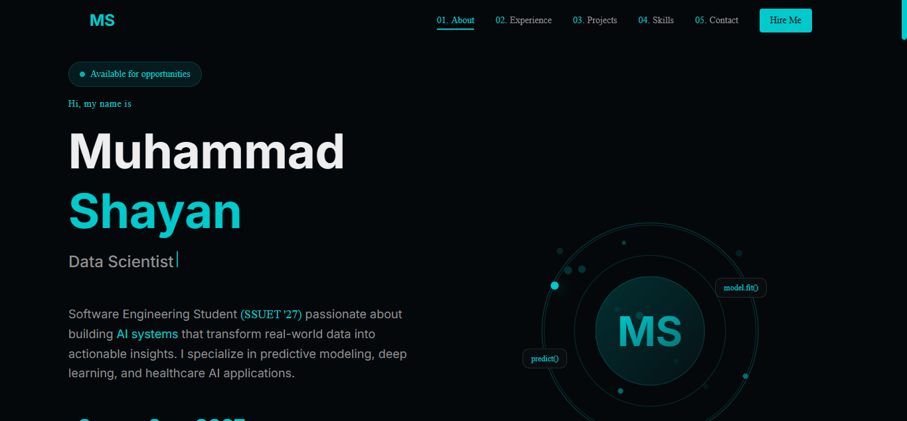
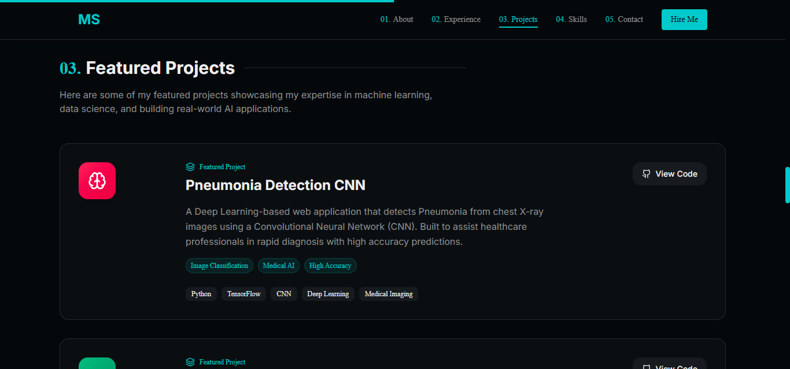
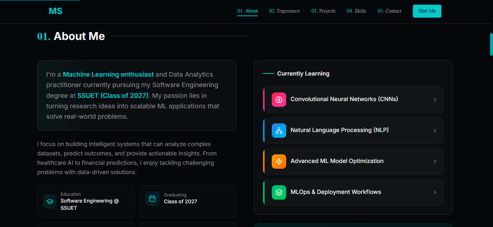
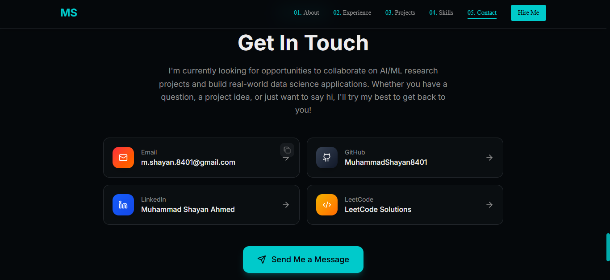

# 🌐 Shayan Portfolio

A modern, responsive, and production-ready personal portfolio built with Next.js to showcase my skills, projects, and experience as a software developer.

---

## 🔗 Live Demo

[](https://shayan-portfolio-eight.vercel.app/)

---

## 📊 Project Status


---

## 👨‍💻 About Me

I am **Muhammad Shayan Ahmed**, a passionate software developer focused on building scalable, efficient, and user-friendly web applications. This portfolio represents my work, skills, and journey in software development.

---

## 📸 Preview

### Home Page



### Projects



### About Me



### Contact



---

## ⚙️ Tech Stack


---

## 🚀 Features

* Fully responsive design (mobile, tablet, desktop)
* Modern UI/UX with clean layout
* Smooth navigation between sections
* Project showcase with structured layout
* Contact section for easy communication
* Optimized performance for fast loading
* SEO-friendly structure

---

## 📂 Project Structure

```
shayan-portfolio/
├── app/
├── components/
├── public/
├── screenshots/
├── README.md
```

---

## 🛠️ Installation & Setup

Clone the repository:

```bash
git clone https://github.com/MuhammadShayan8401/shayan-portfolio.git
```

Navigate to project folder:

```bash
cd shayan-portfolio
```

Install dependencies:

```bash
npm install
```

Run development server:

```bash
npm run dev
```

Open in browser:

```
http://localhost:3000
```

---

## 🚀 Deployment

This project is deployed using Vercel with automatic CI/CD integration from GitHub.

---

## 📈 Future Improvements

* Add dark/light mode toggle
* Improve animations using Framer Motion
* Add blog section
* Enhance SEO optimization
* Add backend contact form

---

## 📬 Contact

* GitHub: [https://github.com/MuhammadShayan8401](https://github.com/MuhammadShayan8401)
* LinkedIn: [https://www.linkedin.com/in/muhammad-shayan-ahmed-05b847281/](https://www.linkedin.com/in/muhammad-shayan-ahmed-05b847281/)
* Portfolio: [https://shayan-portfolio-eight.vercel.app/](https://shayan-portfolio-eight.vercel.app/)

---

## ⭐ Show Your Support

If you like this project, consider giving it a star on GitHub.
